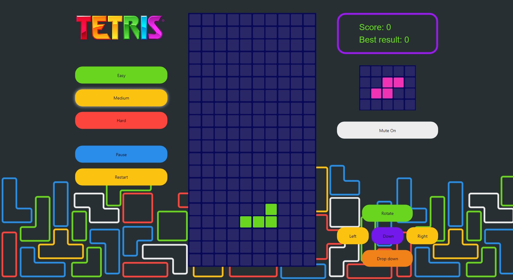

Браузерна версія гри - Тетріс.

Гра написана з використанням чистого JS (без стороніх бібліотек) та html і SASS.

В дизайні гри дотримується загальна концепція оригіналу з додаванням додаткового функціоналу і кольорової гамми.

Реалізована можливість вибору складності:

- Easy - з трьома додатковими фігурами, які спрощують заповнення проміжків;
- Medium - базовий набір фігур з оригінальної гри;
- Hard - додаткові чотири фігури, для підвищення складності проходження;

При згоряні кожного ряду, швидкість падіння фігур зростає як в класичній версії.

Також реалізоване збереження в Local storage стану Mute гри та імені і очок найкращого результату гри по кожній з трьох складностей окремо.
При наступному виборі складності гри у відображені Best result буде відображатись кількість очок саме вибраної складності гри.

У випадку нового рекорду буде активуватись поле для введення імені гравця, але кожен може залишити свій результат анонімно :)
Ця функція стає доступна лише у випадку коли сума набраних очок більша ніж Best result, в протилежному випадку поле для введення імені відсутнє.

Керування доступне за як допомогою мишки, використовуючи екранні кнопоки, так і клавіатурою.

Доступні клавіші:

- вліво/вправо/вниз - відповідно до стрілок клавіатури;
- поворот фігури - стрілка вверх;
- пробіл - опускання фігури відразу до самого низу поля;
- пауза - клавіша англійської літери "P";

План наступних оновлень:

- покращення адаптації під всі розміри вікон пристроїв;
- керування рухами по екрану на мобільній версії гри;
- запис до 10 найкращих результатів по кожній складності гри;
